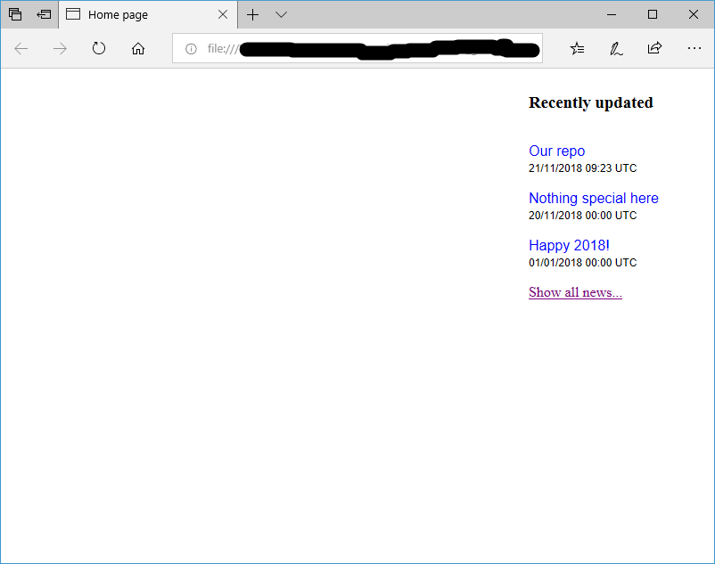
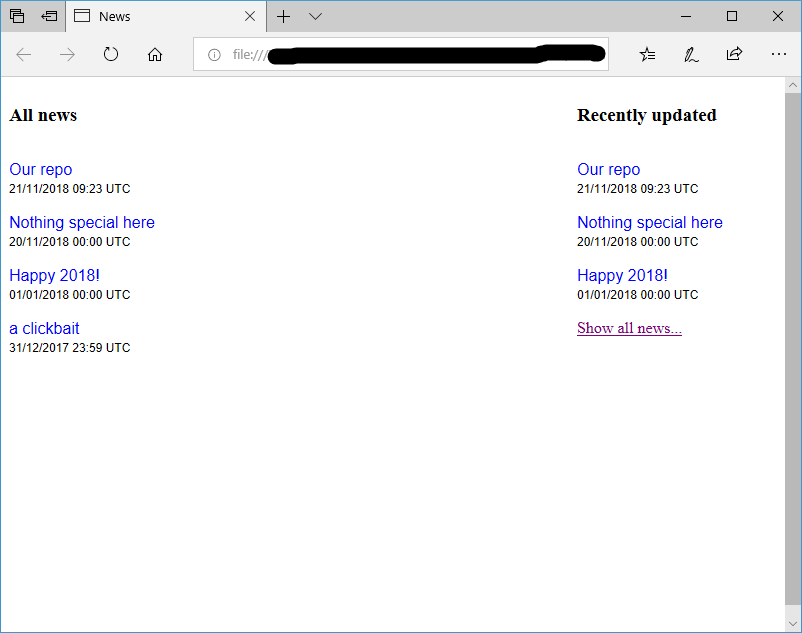

# short-news-viewer

A small news viewer and a separated news page

Online demo [here](https://neihousaigaai.github.io/short-news-viewer/index.html).

## Preview

on Edge, Windows 10:

- `index.html`:



- `news.html`:



## Installation

A small HTML snippet, you can copy-paste, or edit the code easily.

**Note**: When you open `index.html` or `news.html` on local browser, the directory looks like 
```
file:///your/directory/here/index.html
```
, **don't use any Chromium-based browsers**.

## Note

- Kinds of news are saved in `news.json`.

- News format in `news.json`:

```json
{
  "date": <string>,
  "txt": <string>
},
```

- **Be careful to change the name of all `*news_pad*` elements in `index.html` and `news.html`!**

- **RECOMMENDED**: Define your elements (in `index.html` and `news.html`) after
```html
<!-- define other elements here --->
```
line.
